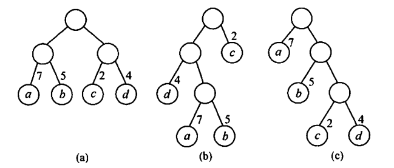

# 数据结构

这是阅读王道、天勤等数据结构考研的复习笔记。

------

目录

[TOC]


------


# 第一章 绪论

重点部分：

- 算法时间复杂度、空间复杂度的分析与计算

提示：

​	算法设计中通常会要求分析时间复杂度、空间复杂度，同时也会出现考察时间复杂度的选择题。


## 1.1 数据结构的基本概念

### 1.1.1 基本概念和术语

 1.  数据

     数据是信息的载体。

 2.  数据元素

     数据元素是数据的基本单位。

 3.  数据对象

     数据对象是具有相同性质的数据元素的集合，是数据的一个子集。

 4.  数据类型

     数据类型是一个值的集合和定义在此集合上的一组操作的总称。

 5.  数据结构

     数据结构包括：逻辑结构、存储结构和数据运算。

     

### 1.1.2 数据结构三要素

 1.  数据的逻辑结构

     逻辑结构与存储无关，是独立于计算机的。下面展示的是逻辑结构的分类：

     

 2.  数据的存储结构

     存储结构是指数据在计算机中的表示，也称为物理结构。

     1. 顺序存储
     2. 链式存储
     3. 索引存储
     4. 散列存储

     

 3.  数据的运算


## 1.2 算法和算法评价

### 1.2.1 算法的基本概念


### 1.2.2 算法效率的度量

 1.  时间复杂度

     时间复杂度的求解一般关注最坏情况下的时间复杂度。

     对于循环体，有：

     ​	时间复杂度取决于最大的那个循环最内层执行次数。

     对于递归，有：

     ​	先推导出类似$T(n)=aT(\frac{n}{b})+f(n)$形式的递推式（其中$f(n)$为一个确定的正函数）。

     ​	然后有
     $$
     T(n)=
     \left\{\begin{matrix} 
     	O(n^{log_{b}a}),\space \space O(n^{log_{b}a}) > O(f(n)) \\ 
     	O(f(n)log_{}n), \space \space O(n^{log_{b}a}) = O(f(n)) \\ 
     	O(f(n)),\space \space O(n^{log_{b}a}) < O(f(n)) 
     \end{matrix}\right.
     $$

 2.  空间复杂度

     空间复杂度有时也会关注平均/最好情况下的空间复杂度。


------


# 第二章 线性表

重点部分：

- 线性表的基本概念
- 线性表的实现：顺序存储、链式存储
- 线性表的应用

提示：线性表是算法题命题的重点，主要着重在性能优化（时间、空间复杂度）上。


## 2.1 线性表的定义和基本操作

### 2.1.1 线性表的定义

​	线性表是具有相同数据类型的 $n\ \ (n\ge0)$ 个元素的有限序列。


### 2.1.2 线性表的基本操作

​	线性表的主要操作如下：

```c++
InitList(&L)，初始化表。

Length(&L)，求表长，返回L的长度。

LocateElem(L, e)，按值查找，查找表中值为e的元素。

GetElem(L, i)，按位查找，获取第i个元素的值。

ListInsert(&L, i, e)，插入操作，在第i个位置上插入e。

ListDelete(&L, i, &e)，删除操作，删除第i个位置的元素，并用e返回删除元素的值。

PrintList(L)，输出L。

Empty(L)，判定L是否为空。

DestroyList(&L)，销毁线性表。
```


## 2.2 线性表的顺序表示

### 2.2.1 顺序表的定义

​	线性表的顺序存储称为<u>顺序表</u>，顺序表的特点是表中元素的逻辑顺序与物理顺序相同。

​	顺序表的存储类型可以描述为：

```C++
#define MaxSize 50
typedef struct{
    ElemType data[MaxSize];
    int length;
}SqList;	//静态分配
```

```C++
#define InitSize 100
typedef struct{
    ElemType *data;
    int MaxSize, length;
}SqList;	//动态分配

L.data = (ElemType*)malloc(sizeof(ElemType)*InitSize);	//For C
L.data = new ElemType[InitSize];						//For C++
```

​	假设线性表 $L$ 纯初的起始位置是 LOC(A)，sizeof(ElemType) 是每个数据元素所占用存储空间的大小，则L对应的顺序存储如图所示：


​	

### 2.2.2 顺序表上基本操作的实现

​	由于其他操作都比较简单，这里只讨论插入、删除、查找的算法。

 1.  插入

     ```C++
     bool ListInsert(SqList &L, int i, ElemType e)
     {
         if (i < 1 || i > L.Length + 1)			//判断i范围是否有效
             return false;
         if (L.Length >= MaxSize)				//当前已满
             return false;
         for (int j = L.Length > j >= i; j--)	//元素后移
             L.data[j] = L.data[j - 1];
         L.data[i - 1] = e;						//放入i
         L.Length++;								//长度+1
         return true;
     }
     ```

     ​	平均情况：假设 $p_i=\frac{1}{n+1}$ 是在第 $i$ 个位置上插入一个结点的概率，则平均移动次数为
     $$
     \scriptsize \sum_{i=1}^{n+1}{p_i(n-i+1)}  = \sum_{i=1}^{n+1}{\frac{1}{n+1}(n-i+1)}  =
     \frac{1}{n+1} \sum_{i=1}^{n+1}{(n-i+1)}  = 
     \frac{1}{n+1} \frac{n(n+1)}{2} 
     = \frac{n}{2}
     $$
     ​	故平均时间复杂度为 $O(n)$。

     

 2.  删除

     ```C++
     bool ListDelete(SqList &L, int i, ElemType e)
     {
         if (i < 1 || i > L.Length)          //判断范围是否有效
             return false;
         e = L.data[i - 1];                  //把被删除的元素给e
         for (int j = i; j < L.Length; j++)  //元素前移
             L.data[j - 1] = L.data[j];      
         L.Length--;                         //长度-1
         return true;
     }
     ```

     ​	平均情况：假设假设 $p_i=\frac{1}{n}$ 是在第 $i$ 个位置上删除一个结点的概率，则平均移动次数为
     $$
     \scriptsize \sum_{i=1}^{n}{p_i(n-i)}  = \sum_{i=1}^{n}{\frac{1}{n}(n-i)}  =
     \frac{1}{n} \sum_{i=1}^{n}{(n-i)}  = 
     \frac{1}{n} \frac{n(n-1)}{2} 
     = \frac{n-1}{2}
     $$
     ​	故平均时间复杂度为 $O(n)$。

     

 3.  按值查找（顺序查找）

     ```C++
     int LocateElem(SqList L, ElemType e)
     {
         int i;
         for (i = 0; i < L.Length; i++)
             if (L.data[i] == e)
                 return i + 1;               //下表为i的元素等于e，返回位序i+1
         return 0;                           //查找失败
     }
     ```

     ​	平均情况：假设假设 $p_i=\frac{1}{n}$ 是要查找的元素在第 $i$ 个位置上的概率，则所需要的比较次数为
     $$
     \scriptsize 
     \sum_{i=1}^{n}{p_i\times i}  
     = \sum_{i=1}^{n}{\frac{1}{n} \times i}  
     = \frac{1}{n} \frac{n(n+1)}{2}  = \frac{n+1}{2}
     $$
     ​	故平均时间复杂度为 $O(n)$。
     
     

## 2.3 线性表的链式表示

顺序表可以随时存取表中的任意一个元素，但是插入和删除需要移动大量的元素。使用链式存储线性表的时候，则不需要移动元素。但是也会失去可随机存取的特性。

### 2.3.1 单链表的定义

​	线性表的链式存储又称为<u>单链表</u>，他是通过一组任意的存储单元来存储线性表中的数据元素。同时，还需要一个指向其后继的指针。

​	单链表中节点类型的描述如下：

```C++
typedef struct LNode                    // 定义节点类型
{
    ElemType data;                      // 数据域
    struct LNode *next;                 // 指针域
} LNode, *LinkList;
```

​	通常用<u>头指针</u>来标识单链表，如单链表 L，头指针为 NULL 的时候表示一个空表。此外，为了操作上的方便，在单链表第一个结点之前附加一个结点，称为头节点：


### 2.3.2 单链表上基本操作的实现

 1.  采用头插法建立单链表

     ​	从一个空表开始，生成新结点，并将读取到的数据插入到头结点之后，如图所示：

     

     ​	代码如下：

     ```C++
     LinkList List_HeadInsert(LinkList &L)   //头插法建立单链表
     {
         LNode *s;
         int x;
     
         L = (LNode *)malloc(sizeof(LNode)); //创建头节点
         L->next = NULL;                     //初始为空
     
         scanf("%d", &x);
         while (x != -1)                     //这里用-1代表结束
         {
             s = (LNode *)malloc(sizeof(LNode));
             s->data = x;
             s->next = L->next;
             L->next = s;                    //新结点插入到表中
             scanf("%d", &x);
         }
         return L;
     }
     ```

     ​	采用头插法建立单链表时，每个节点插入时间为 $O(1)$ ，长度为 $n$ 时，总时间复杂度为 $O(n)$ 。

     

 2.  采用尾插法建立单链表

     ​	头插法建立单链表的时候，生成的链表的次序是反过来的。如果希望两者次序一直，则应该采用尾插法。为此，需要增加一个尾指针 r，使其始终指向当前链表的尾结点，如图所示：

     

     ​	代码如下：

     ```C++
     LinkList List_TailInsert(LinkList &L)   //头插法建立单链表
     {
         int x;
         L = (LNode *)malloc(sizeof(LNode));
         LNode *s, *r = L;                   //r为表尾指针
         scanf("%d", &x);
         while (x != -1)
         {
             s = (LNode *)malloc(sizeof(LNode));
             s ->data = x;
             r -> next = s;
             r = s;                          //r指向新的表尾结点
             scanf("%d", &x);
         }
         r -> next = NULL;                   //尾指针置空
         return L;
     }
     ```

     ​	采用尾插法建立单链表时，每个节点插入时间为 $O(1)$ ，长度为 $n$ 时，总时间复杂度为 $O(n)$ 。

     

 3.  按序号查找结点

     ​	在单链表中从第一个结点出发，直到找到第i个结点为止，否则返回NULL：

     ```C++
     LNode *GetElem(LinkList L, int i)
     {
         int j = 1;                          //计数，初始为1
         LNode *p = L->next;
         if (i < 0)                          //若i无效，则返回NULL
             return NULL;
         if (i == 0)                         //如果i为0则返回头节点
             return L;
         while (p && j < i)                  //从第1个结点开始找
         {
             p = p->next;
             j++;
         }
         return p;                           //若i大于表长则返回NULL
     }
     ```

     ​	按序号查找的时间复杂度为 $O(n)$ 。

     

 4.  按值查找表结点

     ​	从单链表的第一个结点开始，从前向后一次比较表中各节点数据域的值，若某结点数据与的值等于给定值e，则返回指针，如果在整个单链表中都没有找到，则返回NULL。代码如下：

     ```C++
     LNode *LocateElem(LinkList L, ElemType e)
     {
         LNode *p = L->next;
         while (p != NULL && p->data != e)   //从第1个结点开始查找
             p = p->next;
         return p;                           //找到后返回，否则返回NULL
     }
     ```

     ​	按值查找的时间复杂度为 $O(n)$ 。

     

 5.  插入结点操作

     ​	插入结点操作将值为x的新结点插入到单链表的第i个位置上。一般是插入在i-1个结点的之后。

     

     ​	实现插入结点的代码片段如下：

     ```C++
     p = GetElem(L, i-1);					//查找插入位置的前一个结点
     s->next = p->next;
     p->next = s;
     ```

     ​	算法时间复杂度主要集中在查找上，故为 $O(n)$ 。

     

 6.  删除结点操作

     ​	删除结点操作时将单链表的第 i 个结点删除。

     

     ​	实现删除结点的代码片段如下：

     ```C++
     p = GetElem(L, i - 1);					//查找删除位置的前驱结点
     q = p->next;							
     p->next = q->next;						//领q从链表中断开，然后释放
     free(q);
     ```

     ​	算法时间复杂度主要集中在查找上，故为 $O(n)$ 。

     

 7.  求表长操作

     ​	求表长操作就是计算单链表中数据结点（不含头节点）的个数。

     ​	时间复杂度为 $O(n)$ 。

### 2.3.3 双链表

​	单链表节点中只有一个指向其后继的指针，使得单链表只能从头节点一次顺序的向后遍历。为了克服单链表的缺点缺点，引入双链表。


​	双链表中结点类型的描述如下：

```C++
typedef struct DNode                    //双链表
{   
    ElemType data;                      //数据域
    struct DNode *prior, *next;         //前驱后继
} DNode, *DLinkList;
```

​	双链表在查找的操作和单链表的相同，但是在插入和删除上有区别。

 1.  双链表的插入操作

     在双链表p所指的结点之后插入*s，如图所示：

     

     ​	插入操作的代码片段如下：

     ```C++
     s->next = p->next;
     p->next->prior = s;
     s->prior = p;
     p->next = s;
     ```

     ​	1、2步骤必须在4之前，否则*p的后继指针就会丢失。

     

 2.  双链表的删除操作

     ​	删除双链表中结点 *p 的后继节点 *q，如图所示：

     

     ​	删除操作的代码片段如下：

     ```C++
     p->next = q->next;
     q->next->prior = p;
     free(q);
     ```

     

### 2.3.4 循环链表

 1.  循环单链表

     ​	循环单链表和单链表的区别在于，表中最后的一个结点指向的是头节点，从而形成一个环：

     

     ​	在循环单链表中，判空的条件变成：

     ```C++
     L->next == L
     ```

     

 2.  循环双链表

     ​	在循环双链表中，头指针的prior指针还要指向表尾结点：

     

     ​	在撒谎链表中，判空的条件为：

     ```C++
     L->next == L && L->prior == L
     ```

     

### 2.3.5 静态链表

​	静态链表借助数组来描述线性表的链式存储结构，而这里的指针值得是结点的相对地址，又称游标。


​	静态链表结构类型描述如下：

```C++
#define MaxSize 50                      //静态链表的最大长度
typedef struct{
    ElemType data;  
    int next;                           //下一个元素的数组下标
}SLinkList[MaxSize];
```

​	静态链表用next==-1作为其结束的标志。

### 2.3.6 顺序表和链表的比较

​	


------


# 第三章 栈、队列、数组

重点部分：

- 栈和队列的基本概念、顺序存储结构、链式存储结构
- 多维数组的存储
- 特殊矩阵的压缩存储
- 栈、队列、数组的应用

提示：栈和队列的操作及其特征是重点，也容易出现在算法设计题中。


## 3.1 栈

### 3.1.1 栈的基本概念

 1.  栈的定义

     栈（Stack）是只允许在一端进行插入或者操作删除的线性表。

     

     

 2.  栈的基本操作

     ```C++
     InitStack(&S)，初始化一个空栈
         
     StackEmpty(S)，判断一个栈是否为空
         
     Push(&S, x)，进栈
         
     Pop(&S, &x)，出栈
         
     GetTop(S, &x)，读取栈顶元素
         
     DestroyStack(&S)，销毁并释放存储空间
         
     ```

     

 3.  栈的重要数学性质：卡特兰数

     $n$ 个不同元素进栈，出栈元素的不同排列个数为：
     $$
     N = \frac{1}{n+1}C_{2n}^{n} = \frac{(2n)!}{n!(n+1)!}
     $$
     

### 3.1.2 栈的顺序存储结构

​	栈是一种操作受限的线性表，有两种对应的存储方式。

 1.  顺序栈的实现

     ​	顺序栈利用一组地址连续的存储单元存放自栈底到栈顶的数据元素，同时利用 top 指针指示当前栈顶元素的位置。其存储类型可以描述为：

     ```C++
     #define MaxSize 50
     typedef struct
     {
         ElemType data[MaxSize];             //存放数据元素
         int top;                            //栈顶指针
     }SqStack;
     ```

     ​	在这里，栈空条件为 S.top == -1，栈满条件为 S.top == MaxSize - 1。

     

 2.  顺序栈的基本运算

     ​	栈操作的示意图如下图所示：

     

     ​	下面是常用操作的实现：

      1.  初始化

          ```C++
          void InitStack(SqStack &S)
          {
              S.top = -1;                         //初始化栈顶指针
          }
          ```

          

      2.  判空

          ```C++
          bool StackEmpty(SqStack S)
          {
              if (S.top == -1)                    //栈空
                  return true;        
              else                                //非空
                  return false;
          }
          ```

          

      3.  入栈

          ```C++
          bool Push(SqStack &S, ElemType e)
          {
              if(S.top == MaxSize -1)             //栈满
                  return false;
              S.data[++S.top] = e;                //指针先+1再入栈
              return true;
          }
          ```

          

      4.  出栈

          ```C++
          bool Pop(SqStack &S, ElemType &e)
          {
              if(S.top == -1)                     //栈空
                  return false;
              e = S.data[S.top--];                //先出栈指针再-1
              return true;
          }
          ```

          

      5.  读取栈顶元素

          ```C++
          bool GetTop(SqStack S, ElemType &x)
          {
              if(S.top == -1)                     //栈空
                  return false;
              x = S.data[S.top];                  //x记录栈顶元素
              return true;
          }
          ```

          

 3.  共享栈

     ​	利用栈底位置相对不变的特性，让两个顺序栈共享一个数组空间。

     

     ​	top0 = -1 时0号栈为空、top1 = MaxSize 时1号栈为空；top1 - top0 = 1时栈满。	

### 3.1.3 栈的链式存储结构

​	采用链式存储的栈称为链栈，通常采用单链表实现。通常规定链栈没有头结点，Lhead指向栈顶元素。


```C++
typedef struct Linknode
{
    ElemType data;                      //数据域
    struct Linknode *next;              //指针域
} *LiStack;
```


## 3.2 队列

### 3.2.1 队列的基本概念

 1.  队列的定义

     队列 Queue 也是一种操作受限的线性表，只允许在表的异端进行插入，另一端进行删除。

     

     

 2.  队列的基本操作

     ```C++
     InitQueue(&Q)，初始化队列
     
     QueueEmpty(Q)，判断队空
     
     EnQueue(&Q, x)，入队
     
     DeQueue(&Q, &x)，出队
     
     GetHead(Q, &x)，读取队头元素
      
     ```

     

### 3.2.2 队列的顺序存储结构

 1.  队列的顺序存储

     ​	队列的顺序存储类型可以描述为：

     ```C++
     #define MaxSize 50
     typedef struct
     {
         ElemType data[MaxSize];             //存放队列元素
         int front, rear;                    //队头、队尾指针
     } SqQueue;
     ```

     ​	队空条件：Q.front == Q.rear == 0

     

     ​	在这里存在“假溢出”的问题：

     

     ​	可以看到，即使队中可以存放元素，但也出现了上溢出。

     

 2.  循环队列

     ​	在这里引入循环队列的操作，利用取余实现队列的自动循环。

     ​	初始时 Q.front = Q.rear = 0，而每次前进都有 Q.rear/front = (Q.rear/front + 1) % MaxSize 。队列的长度则为 (Q.rear - Q.front + MaxSize) % MaxSize 。

     ​	但是在这种情况下无法区分队满和队空的区别，因此常用的方法是牺牲一个存储单元来区分队空与队满，如下图所示：

     

     ​	在这种情况下，队满条件为 (Q.rear + 1) % MaxSize == Q.front ，而队空条件仍然为 Q.front == Q.rear 。

     此时元素个数仍然为 (Q.rear - Q.front + MaxSize) % MaxSize 。

     

 3.  循环队列的操作

     1. 初始化

        ```C++
        void InitQueue(SqQueue &Q)
        {
            Q.rear = Q.front = 0;               //初始化队首、队尾
        }
        ```

        

     2. 判空

        ```C++
        bool isEmpty(SqQueue Q)
        {
            if(Q.rear == Q.front)               //队空
                return true;
            else
                return false;
        }
        ```

        

     3. 入队

        ```C++
        bool EnQueue(SqQueue &Q, ElemType e)
        {
            if((Q.rear + 1) % MaxSize == Q.front)
                return false;                   //队满
            Q.data[Q.rear] = e;
            Q.rear = (Q.rear + 1) % MaxSize;    //队尾+1取模
            return true;
        }
        ```

        

     4. 出队

        ```C++
        bool DeQueue(SqQueue &Q, ElemType &e)
        {
            if(Q.rear == Q.front)
                return false;                   //队空
            e = Q.data[Q.front];
            Q.front = (Q.front + 1) % MaxSize;  //队头+1取模
            return true;
        }
        ```

        

### 3.2.3 队列的链式存储结构

 1.  队列的链式存储

     ​	链队实际上是一个同时带有队头指针和队尾指针的单链表，头指针指向队头结点，尾指针指向队尾结点。存储表示如下所示：

     ```C++
     typedef struct LinkNode
     {
         ElemType data;
         struct LinkNode *Next;
     } LinkNode;
     
     typedef struct
     {
         LinkNode *front, *rear;
     } LinkQueue;
     ```

     ​	当 Q.front == NULL 且 Q.rear == NULL 的时候，队列为空。

     

     ​	在链式队列中，不带头结点的操作往往比较困难，因此需要采用带头结点的单链表来实现。

     

     ​	

 2.  链式队列的基本操作

     1. 初始化

        ```C++
        void InitQueue(LinkQueue &Q)
        {
            Q.front = Q.rear = (LinkNode *)malloc(sizeof(LinkNode));
            Q.front->Next = NULL;               //初始为空
        }
        ```

        

     2. 判空

        ```C++
        bool isEmpty(LinkQueue Q)
        {
            if(Q.front == Q.rear)
                return true;
            return false;
        }
        ```

        

     3. 入队

        ```C++
        void EnQueue(LinkQueue &Q, ElemType e)
        {
            LinkNode *s = (LinkNode *)malloc(sizeof(LinkNode));
            s->data = e;
            
            s->Next = NULL;                     //尾插法
            Q.rear->Next = s;
            Q.rear = s;
        }
        ```

        

     4. 出队

        ```C++
        bool DeQueue(LinkQueue &Q, ElemType &e)
        {
            if(Q.front == Q.rear)
                return false;
            LinkNode *p = Q.front->Next;
        
            e = p->data;
            Q.front->Next = p->Next;
        
            if(Q.rear == p)                     //若队列中只有一个结点，还需要调整rear
                Q.rear = Q.front;
            
            free(p);
            return true;
        }
        ```

        

### 3.2.4 双端队列

​	双端队列是指两端都可以入队和出队的队列。


​	

​	通常考察的为输入/输出受限的双端队列。

​	输出受限的双端队列是指允许在一端进行插入删除，另一端只能输入的队列：


​	而输入受限的双端队列是指允许在一端进行插入删除，另一端只能输出的双端队列：


​	在考察中，判断是否能根据条件得出序列方法往往是<u>一个个带入验证</u>即可。


## 3.3 栈和队列的应用

### 3.3.1 括号匹配

​	假设有一个括号序列，如下所示：


​	算法的基本思想如下：

- 利用栈存储左括号，遇到右括号就匹配，如果失匹就失败，否则消解。
- 一直重复直到扫描完成，若此时栈中还有括号，则失败。

​	

### 3.3.2 表达式转换、求值

​	主要是中缀、前缀和后缀表达式的转换。常见流程如下图所示：


​	

```C++
//计算优先度
int getPriority(char op)
{
    if (op == '+' || op =='-')
        return 0;
    else
        return 1;
}
```

​	如果需要用到栈与队列来实现的话，假设这里有一个中缀表达式 $a+b-a*((c+d)/e-f)+g $ ，则流程如下：

 1. 中缀转后缀

    ​	自左向右扫描，数字进入队列。

    ​	运算符用一个栈来保存。若栈空，则运算直接入栈。若栈非空，则有三种情况：

    ​	1、栈顶为左括号，则当前元素直接入栈；

    ​	2、当前元素为右括号，则将栈顶至左括号的全部元素全部出栈，并消除括号；

    ​	3、若栈顶为其他运算符，则循环比较当前运算符和栈顶运算符，如果栈顶运算符优先级$\ge$当前运算符优先级，则出栈并继续循环；否则入栈当前运算符，并停止循环。

    ```C++
    void infixToPostFix(char infix[], char s2[], int &top2) //s2为结果栈
    {
        char s1[MaxSize];
        int top1 = -1;
        int i = 0;
        while (infix[i]!='\0')
        {
            // 若为数字则直接入队
            if('0'<=infix[i] && infix[i]<='9')              
            {
                s2[top2++] = infix[i];                      //入队之后到下一位 
                ++i;
            }
            // 若为左括号则直接入栈
            else if (infix[i] == '(')                       
            {
                s1[++top1] = '(';
                ++i;
            }
            // 若为运算符则进行判断
            else if (infix[i] == '+' || infix[i] == '-' || infix[i] == '*' || infix[i] == '/')
            {
                if(top1 ==-1 || s1[top1] == '(' || getPriority(infix[i]) > getPriority(s1[top1]))
                //栈空/左括号/当前运算符大于栈顶预算夫优先级则入栈
                {
                    s1[++top1] = infix[i];
                    ++i;
                }
                else
                    s2[++top2] = s1[top1--];                //否则出栈
            }
            // 若为右括号
            else if (infix[i] == ')')                      
            {
                while (s1[top1]!='(')
                    s2[++top2] = s1[top1--];                //不停出栈
                --top1;                                     //左括号出栈
                ++i;                                        //跳过右括号
            }
        }
        // 将剩余的符号全部放入结果中
        while (top1 != -1)                                  
        {
            s2[++top2] = s1[top1--];
        }
    }
    ```

    

 2. 中缀转前缀

    ​	自右向左扫描，数字之间进入队列。

    ​	运算符用一个栈来保存。若栈空，则运算直接入栈。若栈非空，则有三种情况：

    ​	1、栈顶为右括号，则当前元素直接入栈；

    ​	2、当前元素为左括号，则将栈顶至右括号的全部元素全部出栈，并消除括号；

    ​	3、若栈顶为其他运算符，则循环比较当前运算符和栈顶运算符，如果栈顶运算符优先级$\gt$当前运算符优先级，则出栈并继续循环；否则入栈当前运算符，并停止循环。

    ```C++
    void infixToPreFix(char infix[], int len, char s2[], int &top2) // s2为结果栈
    {
        char s1[MaxSize];
        int top1 = -1;
        int i = len - 1;
        while (i >= 0)
        {
            // 若为数字则直接入队
            if ('0' <= infix[i] && infix[i] <= '9')
            {
                s2[top2++] = infix[i]; // 入队之后到下一位
                --i;
            }
            // 若为右括号则直接入栈
            else if (infix[i] == ')')
            {
                s1[++top1] = ')';
                --i;
            }
            // 若为运算符则进行判断
            else if (infix[i] == '+' || infix[i] == '-' || infix[i] == '*' || infix[i] == '/')
            {
                if (top1 == -1 || s1[top1] == ')' || getPriority(infix[i]) >= getPriority(s1[top1]))
                // 栈空/右括号/当前运算符大于等于栈顶预算夫优先级则入栈
                {
                    s1[++top1] = infix[i];
                    --i;
                }
                else
                    s2[++top2] = s1[top1--]; // 否则出栈
            }
            // 若为左括号
            else if (infix[i] == '(')
            {
                while (s1[top1] != ')')
                    s2[++top2] = s1[top1--]; // 不停出栈
                --top1;                      // 右括号出栈
                --i;                         // 跳过左括号
            }
        }
        // 将剩余的符号全部放入结果中
        while (top1 != -1)
        {
            s2[++top2] = s1[top1--];
        }
    }
    ```

    

 3. 后缀转前缀

    ​	每当扫描到一个运算符的时候，就将两个子表达式放到该运算符的后面。（参考表达式求值）

    

### 3.3.3 表达式求值

​	主要是中缀、前缀和后缀表达式的求值。

```C++
//计算优先度
int getPriority(char op)
{
    if (op == '+' || op =='-')
        return 0;
    else
        return 1;
}
//计算结果
int calSub(float opand1, char op, float opand2, float &result)
{
    if (op == '+')
        result = opand1 + opand2;
    if (op == '-')
        result = opand1 - opand2;
    if (op == '*')
        result = opand1 * opand2;
    if (op == '/')
    {
        if (fabs(opand2) < MIN)
            return 0;
        else
            result = opand1 / opand2;
    }
    return 1;
}
```


 1.  中缀表达式求值

     ​	需要用到两个栈，一个存数据，一个存符号。

     ```C++
     float calInfix(char exp[])
     {
         float s1[MaxSize];
         char s2[MaxSize];
         int top1 = -1, top2 = -1;
         int i = 0;
         while (exp[i] != '\0')
         {
             //数字直接入栈
             if ('0' <= exp[i] && exp[i] <= '9')
             {
                 s1[++top1] = exp[i] - '0';
                 ++i;
             }
             //左括号入运算符栈
             else if (exp[i] == '(')
             {
                 s2[++top2] = '(';
                 ++i;
             }
             //运算符要判断
             else if (exp[i] == '+' || exp[i] == '-' || exp[i] == '*' || exp[i] == '/')
             {
                 //栈空、栈顶为左括号、当前优先级高直接入栈
                 if (top2 == -1 || s2[top2] == '(' || getPriority(exp[i] > getPriority(s2[top2])))
                 {
                     s2[++top2] = exp[i];
                     ++i;
                 }
                 else
                 {
                     float opnd1, opnd2, result;
                     char op;
                     int flag;
                     opnd2 = s1[top1--]; // 第二个操作数先出栈
                     opnd1 = s1[top1--]; // 第一个操作数后出栈
                     op = s2[top2--]; 
                     flag = calSub(opnd1, op, opnd2, result);
                     if (flag == 0)
                     {
                         cout << "ERROR" << endl;
                         break;
                     }
                     s1[++top1] = result; // 将结果压入栈中
                 }
             }
             //右括号
             else if (exp[i] == ')')
             {
                 while(s2[top2] != '(')
                 {
                     float opnd1, opnd2, result;
                     char op;
                     int flag;
                     opnd2 = s1[top1--]; // 第二个操作数先出栈
                     opnd1 = s1[top1--]; // 第一个操作数后出栈
                     op = s2[top2--];
                     flag = calSub(opnd1, op, opnd2, result);
                     if (flag == 0)
                     {
                         cout << "ERROR" << endl;
                         break;
                     }
                     s1[++top1] = result; // 将结果压入栈中
                 }
                 --top2;                  // 左括号出栈
                 ++i;                     // 跳过右 括号
             }
         }
         //如果栈中还有元素，则进行运算 
         while (top2 != -1)
         {
             float opnd1, opnd2, result;
             char op;
             int flag;
             opnd2 = s1[top1--]; // 第二个操作数先出栈
             opnd1 = s1[top1--]; // 第一个操作数后出栈
             op = s2[top2--];
             flag = calSub(opnd1, op, opnd2, result);
             if (flag == 0)
             {
                 cout << "ERROR" << endl;
                 break;
             }
             s1[++top1] = result; // 将结果压入栈中
         }
         return s1[top1];
     }
     ```

     

 2.  后缀表达式求值

     ​	需要用到一个栈，同时存放数据和符号。

     ```C++
     float calPostFix(char exp[])
     {
         float s[MaxSize];
         int top = -1;
         int i = 0;
         while (exp[i] != '\0')
         {
             // 若为数字则直接入队
             if ('0' <= exp[i] && exp[i] <= '9')
                 s[++top] = exp[i] -  '0';
             // 若为运算符则直接计算
             else if (exp[i] == '+' || exp[i] == '-' || exp[i] == '*' || exp[i] == '/')
             {
                 float opnd1, opnd2, result;
                 char op;
                 int flag;
                 opnd2 = s[top--];           //第二个操作数先出栈
                 opnd1 = s[top--];           //第一个操作数后出栈 
                 op = exp[i];
                 flag = calSub(opnd1, op, opnd2, result);
                 if(flag == 0)
                 {
                     cout << "ERROR" << endl;
                     break;
                 }
                 s[++top] = result;          //将结果压入栈中
             }
             ++i;
         }
         return s[top];
     }
     ```

     

 3.  前缀表达式求值

     ​	需要用到一个栈，同时存放数据和符号，但是使从后往前扫描，且取出顺序不同。

     ```C++
     float calPreFix(char exp[], int len)
     {
         float s[MaxSize];
         int top = -1;
         for (int i = len - 1; i >= 0; --i)
         {
             if('0' <= exp[i] && exp[i] <= '9')
                 s[++top] = exp[i] - '0';
             else
             {
                 float opnd1, opnd2, result;
                 char op;
                 int flag;
                 opnd1 = s[top--]; // 第一个操作数先出栈
                 opnd2 = s[top--]; // 第二个操作数后出栈
                 op = exp[i];
                 flag = calSub(opnd1, op, opnd2, result);
                 if (flag == 0)
                 {
                     cout << "ERROR" << endl;
                     break;
                 }
                 s[++top] = result; // 将结果压入栈中
             }
         }
         return s[top];
     }
     ```

     

## 3.4 数组和特殊矩阵

在这里，我们将精力主要集中在如何将矩阵更有效的存储在内存中吗，并能方便地的从矩阵中提取元素。

### 3.4.1 数组的定义

​	数组是由 n 个相同类型的数据元素构成的有限序列。


### 3.4.2 数组的存储结构

​	大多数计算机提供了数组数据类型，逻辑意义上的数组可以采用计算机语言中的数组数据类型进行存储，一个数组的所有元素在内存中占用了一段连续的存储空间。

​	对于一维数组，其存储结构关系式为：
$$
LOC(a_{i}) = LOC(a_{0})+i \times L (0\le i \le n)
$$
​	对于二维数组，按照行优先的存储形式为：


​	关系式为：
$$
LOC(a_{i,j})=LOC(a_{0,0})+[i \times (h_{2}+1)+j]\times L
$$
​	按照列优先的存储形式为：


​	关系式为：
$$
LOC(a_{i,j})=LOC(a_{0,0})+[j \times (h_{1}+1)+i]\times L
$$


### 3.4.3 特殊矩阵的压缩存储

 1.  对称矩阵

     ​	对于n阶对称矩阵，上三角区和下三角所有对应元素相同，若仍然采用二维数组存储，则几乎会浪费一半的存储空间，为此可以只存储一半的矩阵。

     

     ​	在这里有，假设我们只存储下三角部分：

     ​	第一行：1个元素

     ​	第二行：2个元素

     ​	...

     ​	第 i 行：j - 1个元素

     ​	则元素 $a_{i,j}$ 在数组 B 中的下标 $k=1+2+...+(i-1)+(j-1)=\frac{i(i-1)}{2}+j-1$ 。

     ​	因此，元素之间的对应下标有：
     $$
     k=
     \left\{\begin{matrix} 
       \frac{i(i-1)}{2}+j-1，\space下三角、主对角线\\  
       \frac{j(j-1)}{2}+i-1，\space上三角
     \end{matrix}\right.
     $$

     

 2.  三角矩阵

     在下三角矩阵中，上三角区中所有元素均为同一常量。其存储思想和对称矩阵类似。

     在下三角矩阵中，元素下标之间的对应关系为：
     $$
     k=
     \left\{\begin{matrix} 
       \frac{i(i-1)}{2}+j-1，\space i\ge j （下三角和主对角线）\\  
       \frac{n(n+1)}{2}，\space j < j （上三角区）
     \end{matrix}\right.
     $$
     下三角矩阵在内存中的存储形式：

     

     

     上三角矩阵中，下三角区的所有元素均为同一常量。

     在上三角矩阵中，元素下标之间的对应关系为：
     $$
     k=
     \left\{\begin{matrix} 
       \frac{(i-1)(2n-i+2)}{2}+(j-i)，\space i \le j （上三角和主对角线）\\  
       \frac{n(n+1)}{2}，\space j < j （下三角区）
     \end{matrix}\right.
     $$
     上三角矩阵的在内存中的存储形式：

     

     

 3.  三对角矩阵

     
     
     元素与下标之间的对应关系为：
     $$
     k=2i+j-3
     $$
     在内存中存储形式为：
     
     
     
     反之，要是知道元素在数组的第k个位置，则可以得到
     $$
     i= \lfloor \frac{(k+1)}{3} + 1 \rfloor ,\space j=k-2i+3
     $$
     

### 3.4.4 稀疏矩阵

​	一般来说，矩阵里面元素个数很少的情况就称为稀疏矩阵。

​	稀疏矩阵既可以用数组存储，也可以采用十字链表法存储。


------


# 第四章 串

重点部分：

- KMP算法原理
- next数组推理过程
- nextval数组求解方法

提示：手工计算next数组可以先计算出表然后变形。nextval数组的求解方法需要了解。

## *4.1 串的定义和实现

### 4.1.1 串的定义

​	略。


### 4.1.2 串的存储结构

​	略。


### 4.1.3 串的基本操作

​	略。


## 4.2 串的模式匹配

### 4.2.1 简单模式匹配算法

​	略。


### 4.2.2 KMP算法（看天勤视频）

​	在 KMP 算法中，查找是不回头的，一次查找就结束。为了实现这个想法，我们需要利用前后缀。前缀指的是除了最后一个字符以外的所有头部子串，而后缀指的是除了第一个字符以外的所有尾部子串。

​	在 KMP 算法中如果出现失匹，则直接移动模式串，<u>把原来的前缀移动到后缀的位置</u>。（这里需要注意的是，在计算机中无法直接移动模式串，因此实际代码略有不同）

​	而在这里可以发现，实际上移动的位置就是最长公共前后缀的位置。

​	因此，根本无需主串，只需要知道模式串就可以得出如何移动即可。

​	在这里，为了方便起见，在 KMP 算法中，模式串的 [0] 位置通常为空，从 [1] 开始存储。

​	例如对于模式串$S$：
$$
A\space B\space A\space B\space A\space A\space A\space B\space A\space B\space A\space A
$$
​	$S[0]$为空，$S[1]$为A... 

​	因为对于这个模式串$S$，任何位置都有可能发生失匹，因此每一位都要求出对应的移动位置。如果将<u>移动模式串用计算机语言来表述</u>，则应该说：
$$
对于S[1]发生失匹，则下次从S[0]开始比较；\\
对于S[2]发生失匹，则下次从S[1]开始比较；\\
对于S[3]发生失匹，则下次从S[1]开始比较；\\
对于S[4]发生失匹，则下次从S[2]开始比较...
$$
​	将这里的目标记为一个数组，则有：
$$
0 \space 1 \space 1 \space2...
$$
​	依次类推，可以得到一个数组：
$$
0\space 1\space 1\space 2\space 3\space 4\space 2\space 2\space 3\space 4\space 5\space 6
$$
​	将最前面 [0] 位置置空，这就是 next 数组。


​	但是如果利用这个方法计算 next 数组，时间复杂度为$O(n^2)$，这没有意义。因此需要一种高效的方式来求 next 数组。

​	我们知道，在一个 next 数组中，必然有$t, j$，使得 $next[j]=t$ 。那么在这种情况下我们就可以尝试推导 $next[j+1]$ 的值：

- 若 $p_j=p_t$ ，则可得其最长公共前后缀+1，也即 $next[j+1]=t+1=next[j]+1$ 。
- 若 $p_j \ne p_i$ ，则可以转成“模式串失匹，需要移动到什么位置的问题”，循环的将 $t$ 赋值为 $next[t]$ ，直到 $t=0$ 或者满足 $p_j=p_t$ 为止。当 $t=0$ 时， $next[j+1]=1$ 。

​	代码见视频。


如何求解nextval数组？


------


# 第五章 树

重点部分：

- 树的基本概念
- 二叉树
- 树与森林
- 哈夫曼树、哈夫曼编码
- 并查集及其应用

提示：需要掌握树与二叉树的性质、遍历、转换、存储结构等，满二叉树、完全二叉树、线索二叉树、哈夫曼树的性质，二叉排序树和二叉平衡树的性质和操作，都是必然会涉及的内容。

## 5.1 树的基本概念

### 5.1.1 树的定义

​	树是 n 个结点的有限集，有且仅有一个特定的称为根的结点。

### 5.1.2 基本术语

​	度：树中一个结点的孩子个数称为该节点的度，树中结点的最大度数称为树的度。度为0的结点称为叶子节点。

​	深度：自根节点开始自顶向下逐层累加。

​	高度：自叶节点开始自底向上逐层累加。

### 5.1.3 树的性质

- （重要）对于任何树，都有：$结点数=所有结点度数之和+1$，也即 $n=n_1+2*n_2+..+k*n_k+1$ 。
- （重要）对于任何树，都有：$n=n_0+n_1+...+n_k$ 。
- 度为 $m$ 的树中，第i层上最多有 $m^{i-1}$ 个结点。
- 高度为 $h$ 的 $m$ 叉树，至多有 $\frac{m^k-1}{m-1}$ 个结点。
- 具有 $n$ 个结点的 $m$ 叉树，其最小高度为 $\lceil log_m(n(m-1)+1) \rceil$ 。


## 5.2 二叉树的概念

### 5.2.1 二叉树的定义及其主要特性

​	二叉树是一种特殊的树形结构，不存在度大于 2 的结点。二叉树是一颗有序树。


​	二叉树的性质：

- 对于一个非空二叉树，有 $n_0=n_2+1$ 。

- 高度为 $h$ 非空二叉树上第 $k$ 层最多有 $2^{k-1}$ 个结点，整个树上最多有 $2^h-1$ 个结点。

  


​	满二叉树：高度为 $h$ ，且含有 $2^h-1$ 个结点的二叉树。


- 对于满二叉树，除了叶子节点之外的每个结点度数均为 2 。
- 在满二叉树中，对于编号为 $i$ 的结点，若有双亲，则双亲编号为 $\lfloor \frac{i}{2} \rfloor$；若有左孩子，则左孩子编号为 $2i$ ；若有右孩子，则右孩子编号为 $2i+1$ 。


​	完全二叉树：高度为 $h$ ，有 $n$ 个结点的二叉树，当且仅当每个结点与高度为 $h$ 的满二叉树中编号为 1~n 的结点一一对应时称为完全二叉树。


- 若 $i \le \lfloor \frac{n}{2} \rfloor$ ，则结点为分支，否则为叶子结点。
- 度为 1 的结点只有一个，且只有左孩子。
- 对一个有 $n$ 个结点的完全二叉树，若高度为h，有 $2^{h-1} -1< n \le 2^h-1$ 或 $2^{h-1} \le n<2^h$ ，因此有 $h-1<log_2(n+1) \le h$ ，也即：$h = \lceil log_2(n+1) \rceil $ 或 $h = \lfloor log_2n \rfloor + 1$ 。


### 5.2.2 二叉树的存储结构

 1.  顺序存储结构

     

 2.  链式存储结构

     二叉树一般采用的是链式存储结构，用链表结点来存储二叉树中的每个结点。存储结构表示如下：

     

     其存储结构描述如下：

     ```C++
     typedef struct BiTNode
     {
         ElemType data;
         struct BiTNode *lChild, *rChild;
     } BiTNode, *BiTree;
     ```


​	在这里，需要注意的是，在一个含有 n 个结点的二叉链表中，含有 n+1 个空链域，这可以用来构成线索链表。


## 5.3 二叉树的遍历和线索二叉树

### 5.3.1 二叉树的遍历

​	二叉树的遍历是指按某条搜索路径访问树中每个结点。

​	由二叉树的递归定义可知，遍历一颗二叉树要决定对根节点 N，左子树 L 和右子树 R 的访问顺序。

 1.  先序遍历

	先序遍历的访问顺序：根 - 左 - 右

	```C++
	void PreOrder(BiTree T)
	{
	    if (T!=NULL)
	    {
	        visit(T);
	        PreOrder(T->lChild);
	        PreOrder(T->rChild);
	    }
	}
	```

	

 2.  中序遍历

	中序遍历的访问顺序：左 - 根 - 右

	```C++
	void InOrder(BiTree T)
	{
	    if(T!=NULL)
	    {
	        InOrder(T->lChild);
	        visit(T);
	        InOrder(T->rChild);
	    }
	}
	```

	

 3.  后序遍历

	后序遍历的访问顺序：左 - 右 - 根

	```C++
	void PostOrder(BiTree T)
	{
	    if(T!=NULL)
	    {
	        PostOrder(T->lChild);
	        PostOrder(T->rChild);
	        visit(T);
	    }
	}
	```

	

### 5.3.2 线索二叉树

1. 线索二叉树的基本概念

  ​	传统的二叉树进能够体现父子关系，而不能直接得到节点在遍历中的前驱或者后继。但是我们知道，在含有 n 个节点的二叉树中，有 n+1 个空指针。由此可以利用这些空指针来加速查找结点前驱和后继的速度。

  ​	线索二叉树的结构如下：

  

  ​	而标志域的含义如下：

  

  ​	对于线索二叉树，其存储结构描述如下：

  ```C++
  typedef struct ThreadNode
  {
      ElemType data;
      struct ThreadNode* lChild, *rChild;
      int lTag, rTag;
  }ThreadNode, *ThreadTree;
  ```

  

2. 中序线索二叉树的构造

  ​	二叉树的**线索化**是指将二叉链表中的空指针改为指向前驱或者后继的线索。线索化的实质就是遍历一次二叉树。

  ​	以中序线索二叉树的建立为例。附设指针 pre 指向刚刚访问过的结点，指针 p 指向正在访问的结点，即 pre 指向 p 的前驱。在中序遍历的过程中，检查 p 的左指针是否为空，若为空就将它指向 pre ；检查 pre 的右指针是否为空，若为空就将它指向 p 。

  

  ​	通过中序遍历对二叉树线索化的递归算法如下：

  ```C++
  void InThread(ThreadTree &p, ThreadTree &pre)
  {
      if (p != NULL)
      {
          InThread(p->lChild, pre);   //递归，线索化左子树
          if (p->lChild == NULL)      //左子树为空，建立前驱线索
          {
              p->lChild = pre;
              p->lTag = 1;
          }
          if (pre != NULL && pre->rChild == NULL)
          {
              pre->rChild = p;        //建立前驱结点的后继线索
              pre->rTag = 1;
          }
          pre = p;                    //标记当前节点成为刚刚访问过的结点
          InThread(p->rChild, pre);   //递归，线索化右子树
      }
  }
  ```

  ​	主要过程算法如下：

  ```C++
  void CreateInThread(ThreadTree T)
  {
      ThreadTree pre = NULL;
      if (T != NULL)
      {
          InThread(T, pre);       //对非空二叉树线索化
          pre->rChild = NULL;
          pre->rTag = 1;          //处理最后一个结点
      }
  }
  ```

  ​	

  ​	为了方便，可以在二叉树的线索链表上也添加一个头结点，使其 lChild 的指针指向根节点，rChild 的指针指向中序遍历访问时最后一个结点；而二叉树中的第一个结点 lChild 指针和最后一个结点的 rChild 指针指向头结点。

  

  

3. 中序线索二叉树的遍历

	中序线索二叉树的节点中隐含了线索二叉树的前驱和后继信息。因此遍历的过程可以这么表述：

	```C++
	ThreadNode *Firstnode(ThreadNode *p)    //求第一个结点
	{
	    while (p->lTag == 0)
	    {
	        p = p->lChild;
	    }
	    return p;
	}               
	
	ThreadNode *Nextnode(ThreadNode *p)     //求后继
	{
	    if (p->rTag == 0)
	    {
	        return Firstnode(p->rChild);
	    }
	    else
	    {
	        return p->rChild;
	    }
	}
	
	void Inorder(ThreadNode *T)
	{
	    for (ThreadNode *p = Firstnode(T);p!=NULL;p = Nextnode(p))
	        visit(p);
	}
	```

	

4. 先序和后序线索二叉树

	通过变动线索化构造的代码段与调用左右子树递归函数的位置，就可以建立先序、后序线索二叉树。

	

## 5.4 树、森林

### 5.4.1 树的存储结构

​	树的存储方式有多种，这里介绍三种常用的存储结构：

1. 双亲表示法

	​	这种存储方式采用一组连续空间来存储每个结点，同时在每个节点中增设一个伪指针，用来指示位置。

	

	​	双亲表示法的存储结构描述如下：

	```C++
	#define MAX_TREE_SIZE 100
	typedef struct
	{
	    ElemType data;
	    int parent;
	} PTNode;
	
	typedef struct
	{
	    PTNode node[MAX_TREE_SIZE];
	    int n;
	} PTree;
	```

	

2. 孩子表示法

	​	孩子表示法是将每个结点的孩子结点动用单链表链接奇拉形成一个线性结构，此时 n 个结点就有 n 个孩子链表。

	

	

3. 孩子兄弟表示法

	​	孩子兄弟表示法又称**二叉树表示法**，即以二叉链表作为树的存储结构。孩子兄弟表示法的存储结构描述如下：

	```C++
	typedef struct CSNode
	{
	    ElemType data;
	    struct CSNode *firstChild, *nextSibling;
	} CSNode, *CSTree;
	```

	

	

### 5.4.2 树、森林、二叉树的转换

​	给定一棵树，可以找到唯一的一颗二叉树与之对应。从物理结构上看，他们的二叉链表是相同的，只不过是解释不同而已。


​	树转换为二叉树的规则是：左孩子右兄弟，也就是每个结点的左指针指向它的第一个孩子，右指针指向它在树中相邻的右兄弟。


​	森林转化为二叉树的规则与树类似，先将森林中的每棵树转化为二叉树，由于任何一棵和树对应的二叉树右子树必为空，则可以把第二棵树根视为第一颗树根的有兄弟等以此类推，将森林可以转化为二叉树。


​	二叉树转换为森林的规则：若二叉树非空，则二叉树的根及其左子树为第一棵树的二叉树形式，将根的右链断开。二叉树根的右子树又可以视为一个由除了第一棵树以外的森林转换后的二叉树，以此类推可以转化为内知道最后一棵没有右子树的二叉树为止。


### 5.4.3 树、森林的遍历


## 5.5 树与二叉树的应用

### 5.5.1 哈夫曼树、哈夫曼编码

1. 哈夫曼树的定义

	​	在许多应用中，树中结点会被赋予**权重**。从树根到该结点的路径长度与结点权重的乘积，称为该结点的**带权路径长度**，树中所有叶结点的带权路径长度之后称为**树的带权路径长度**，记为
	$$
	WPL = \sum_{i=1}^{n} w_{i}l_{i}
	$$
	​	其中，$w_i$ 是权重，$l_i$ 是路径长度。

	​	在含有 n 个带权叶结点的二叉树中，WPL 最小的二叉树称为哈夫曼树，也即**最优二叉树**。比如在下图中，C 的 WPL 最小，也就是哈夫曼树。

	

	

	

2. 哈夫曼树的构造

	​	给定 n 个权值分别为 w1，w2，…，wn 的结点，构造哈夫曼树的算法描述如下：
	​	1、将这 n 个结点分别作为 n 棵仅含一个结点的二叉树，构成森林 F 。
	​	2、构造一个新结点，从 F 中选取两棵根结点权值最小的树作为新结点的左、右子树，并且将新结点的权值置为左、右子树上根结点的权值之和。
	​	3、从 F 中删除刚才选出的两棵树，同时将新得到的树加入 F 中。
	​	4、重复步骤 2 和 3 ，直至 F 中只剩下一棵树为止。

	​	

	​	比如下图就展示了一个过程。

	

	

3. 哈夫曼编码

	​	哈夫曼编码是一种有效的数据压缩编码。

	​	若没有一个编码是另一个编码的前缀，我们就称这样的编码为**前缀编码**。

	​	由哈夫曼树得到哈夫曼编码的过程如下：将每个字符当作一个独立的结点，其权值为出现的次数，构造出对应的哈夫曼树。显然所有的字符节点都出现在叶结点中。然后将字符的编码解释为根到路径上标记的序列。比如下图所示。

	

	​	这样构造出的哈夫曼树 WPL 为
	$$
	WPL=1×45+3×(13+12+16)+4×(5+9)=224
	$$
	​	需要注意的是，构造出的哈夫曼树可能是不同的，但是 WPL 必然是相同的。

	

### 5.5.2 并查集

​		通常用树的双亲表示作为并查集的存储结构，每个子集以一棵树表示。所有表示子集的树构成表示全集的森林，存放在双亲表示数组内。通常用数组元素的下标代表元素名，用根节点的下标代表子集名，根节点的双亲结点为负数。

​	例如，若开始时有一个集合 $S = \left \{  0,1,2,3,4,5,6,7,8,9 \right \}  $ 的表示如下：


​	经过一段时间的计算变成三个子集 $S_1 = \left \{  0,6,7,8\right \},S_2=\left \{ 1,4,9 \right \},S_3=\left \{ 2,3,5 \right \}   $ 的表示如下：


​	那么为了得到两个子集的并，只需要将其中一个子集的根节点的双亲指针指向另一个集合的根节点。也即 $S_1 \cup S_2$ 的表示如下：


​	在采用树的双亲指针数组作为并查集的存储表示的时候，集合的元素编号是从 0 到 size - 1。

​	

​	并查集的结构定义如下：

```C++
#define SIZE 100
int UFSets[SIZE];
```

​	并查集的初始化：

```C++
void Initial(int S[])
{
    for (int i = 0; i < SIZE; i++)
        S[i] = -1;
}
```

​	并查集的查找：

```C++
int Find(int S[], int x)
{
    while (S[x] >= 0)
    {
        x = S[x];
    }
    return x;
}
```

​	并查集的并操作：

```C++
void Union(int S[], int Root1, int Root2)
{
    S[Root2] = Root1;
}
```


------


# 第六章 图

重点部分：

- 图的基本概念
- 图的存储及基本操作：邻接矩阵、邻接表、邻接多重表、十字链表
- 图的遍历：BFS、DFS
- 图的基本应用：最小生成树、最短路径、拓扑排序、关键路径

提示：图的相关算法较多，通常只要求掌握基本思想和实现步骤，而算法的实现不是重点。


## 6.1 图的基本概念

### 6.1.1 图的定义

​	图 G 由顶点集 V 和边集 E 组成，记为 G = （V，E）。

 1.  有向图

	​	有方向的图。

 2.  无向图

	​	没有方向的图。

 3.  简单图、多重图

	​	一个图如果满足：1、不存在重复边，2、不存在顶点到自身的边，那么称之为简单图。若图中某两个顶点之间的边大于一条，又允许顶点和自身关联，则是多重图。

 4.  完全图

	​	有 $\frac{n(n-1)}{2}$ 条的边的**无向图**被称为完全图。在完全图中，任意两个顶点之间都存在边。

	​	而对于有向图，则是有 $n(n-1)$ 条弧的**有向图**称为完全有向图。在有向完全图中，任意两个顶点之间都存在方向相反的弧。

 5.  子图

	​	对于一个图 G，若有图 G‘ 使得 V’∈V、E‘∈E，则称 G' 是 G 的子图。

 6.  连通、连通图和连通分量

	​	在无向图中，若从顶点 v 到顶点 w 有路径存在，则称 v 和 w 是连通的。若 G 中任意两个顶点都是连通的，则称 G 是**连通图**，否则是**非连通图**。无向图中的**极大连通子图**称为**连通分量**。

 7.  强连通图、强连通分量

	​	在有向图中，若有一对顶点 v 和 w，互相都有路径，则称这两个顶点是强连通的。如图中任何一对顶点都是强连通的，则称其为**强连通图**。有向图中的**极大强连通子图**称为**强连通分量**。

 8.  生成树、生成森林

	​	连通图的生成树是包含图中全部顶点的**极小连通子图**。若图中顶点数为 n，则生成树含有 n-1 条边。

 9.  顶点的度、入度和出度

	​	在无向图中，顶点 v 的度是指顶点 v 的边的条数。对于 n 个顶点，e 条边的无向图，度数之和 = 2e，也就是无向图的全部顶点的度等于边数的两倍。

	​	有向图中，顶点 v 的度分为入度和出度，入度和出度之和是顶点的度。对于 n 个顶点，e 条边的有向图，入度之和 = 出度之和 = e。

 10.  边的权和网

	​	在一个图中，每条边都可以带权，这种边上有权的图称为网。

 11.  稠密图、稀疏图

	​	边数很少的图称为稀疏图。反之称之为稠密图。

 12.  路径、路径长度和回路

	​	顶点 v 到 w 之间的路径。路径上边的数量称为路径长度。

 13.  简单路径、简单回路

	​	在路径中，顶点不重复出现的路径称为简单路径。

	​	除了第一个顶点和最后一个顶点以外，其余顶点不重复出现的路径叫做简单回路。

 14.  距离

	​	如果最短路径存在，则称此路径的长度是距离。如果不存在路径，则距离记为无穷。

 15.  有向树


## 6.2 图的存储以及基本操作

### 6.2.1 邻接矩阵法

​	所谓的邻接矩阵是指用一个一维数组存储顶点的信息，用一个二维数组存储图中边的信息。这一二维数组被称为邻接矩阵。


​	有向图、无向图和网对应的邻接矩阵如图所示。图的邻接矩阵存储结构定义如下：

```C++
#define MaxVertexNum 100
typedef char VertexType;
typedef int EdgeType;

typedef struct
{
    VertexType Vex[MaxVertexNum];               //顶点表
    EdgeType Edge[MaxVertexNum][MaxVertexNum];  //邻接矩阵表
    int vexNum, arcNum;
} MGraph;
```

​	

​	图的邻接矩阵有以下特点：

1. 无向图的邻接矩阵一定是对称矩阵（并且唯一）。因此在实际存储时只需要存储三角矩阵。
1. 对于**无向图**，邻接矩阵的第 $i$ 行（或者第 $i$ 列）**非零元素的个数**正好是顶点的**度**。
1. 对于**有向图**，邻接矩阵的**第 $i$ 行非零元素的个数**正好是顶点的**出度**；**第 $i$ 列非零元素的个数**正好是顶点的**入度**。
1. 对于任意一个图 $G$ 的邻接矩阵 $A$，$A^n[i][j]$ 的元素等于由顶点 $i$ 到 $j$ 的长度为 $n$ 的**路径的数量**。


### 6.2.2 邻接表法

​	邻接表法更适合稀疏图。邻接表就是对图 $G$ 中的每个顶点 $v_i$ 建立一个单链表，第 $i$ 个单链表中的结点表示依附于顶点 $v_i$ 的边（对有向图是以该顶点为尾的弧），这个单链表就称为顶点 $v_i$ 的边表。边表的头指针和顶点的数据信息采用顺序存储，在邻接表中有两种结点：顶点表结点和边表结点。


​	无向图、有向图的邻接表示例如下所示：


​	图的邻接表存储结构定义如下：

```C++
#define MaxVertexNum 100

typedef struct ArcNode                          //边表结点
{
    int adjvex;                                 //弧指向的顶点位置
    struct ArcNode *next;                       //指向下一条弧的指针
} ArcNode;

typedef struct VNode                            //顶点表结点
{
    VertexType data;                            //顶点信息
    ArcNode *first;                             //指向第一条依附于该顶点的弧的指针
} VNode, AdjList[MaxVertexNum];

typedef struct
{
    AdjList vertices;                           //邻接表
    int vexnum, arcnum;                         //图的顶点数和弧数
} ALGraph;
```

​	

​	图的邻接表有以下特点：

1. 若 $G$ 为无向图，则所需的存储空间是 $O(\left | V \right | + \left | 2E \right | )$ ；若 $G$ 是有向图，则所需的存储空间是 $O(\left | V \right | + \left | E \right | )$。前者的倍数是 $2$ 是因为无向图中每条边出现两次。
2. 在邻接表中，给定一顶点，只需要读取他的邻接表就能找到他的所有邻边；但是在邻接矩阵中，相同的操作需要扫描一行，需要 $O(n)$ 的时间。但是若要确定两顶点之间是否存在边，邻接表需要在对应的结点边表中查找另一个结点，而邻接矩阵可以直接找到。
3. 在**有向图**的邻接表表示中，求一个给定顶点的出度只需要计算邻接表的中的节点个数，但是计算入度就需要遍历所有的邻接表。


### 6.2.3 十字链表法


### 6.2.4 邻接多重表


### 6.2.5 图的基本操作


## 6.3 图的遍历

### 6.3.1 广度优先搜索


### 6.3.2 深度优先搜索


### 6.3.3 图的遍历、图的连通性


## 6.4 图的应用

### 6.4.1 最小生成树


### 6.4.2 最短路径


### 6.4.3 有向无环图描述表达式


### 6.4.4 拓扑排序


### 6.4.5 关键路径


------


# 第七章 查找


## 7.1 查找的基本概念


## 7.2 顺序查找和折半查找

### 7.2.1 顺序查找


### 7.2.2 折半查找


### 7.2.3 分块查找


## 7.3 树形查找

### 7.3.1 二叉排序树


### 7.3.2 平衡二叉树


### 7.3.3 红黑树


## 7.4 B树、B+树

### 7.4.1 B树及其基本操作


### 7.4.2 B+树的基本概念


## 7.5 哈希（散列）表

### 7.5.1 散列表的基本概念


### 7.5.2 散列函数的构造方法


### 7.5.3 处理冲突的方法


### 7.5.4 散列查找及其性能分析


------


# 第八章 排序


## 8.1 排序的基本概念

### 8.1.1 排序的定义


## 8.2 插入排序

### 8.2.1 直接插入排序


### 8.2.2 折半插入排序


### 8.2.3 希尔排序


## 8.3 交换排序

### 8.3.1 冒泡排序


### 8.3.2 快速排序


## 8.4 选择排序

### 8.4.1 简单选择排序


### 8.4.2 堆排序


## 8.5 归并排序、基数排序

### 8.5.1 归并排序


### 8.5.2 基数排序


## 8.6 各种内部排序算法的比较和应用

### 8.6.1 内部排序算法比较


### 8.6.2 内部排序算法应用


## 8.7 外部排序

### 8.7.1 外部排序的基本概念


### 8.7.2 外部排序的方法


### 8.7.3 多路平衡归并与败者树


### 8.7.4 置换选择排序


### 8.7.5 最佳归并树


